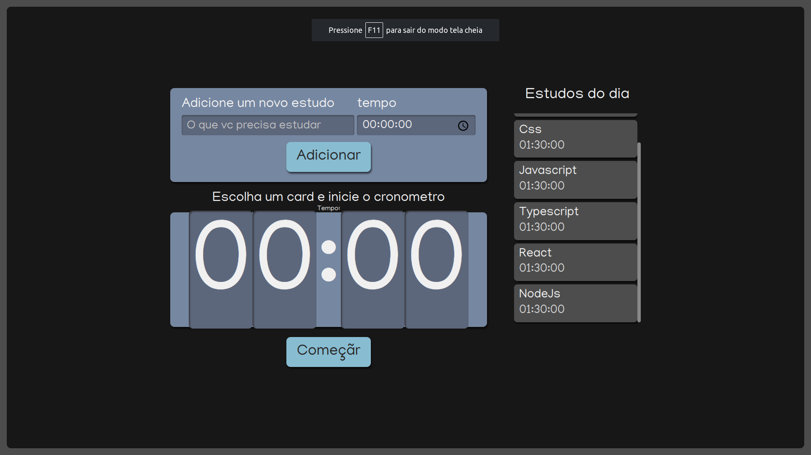
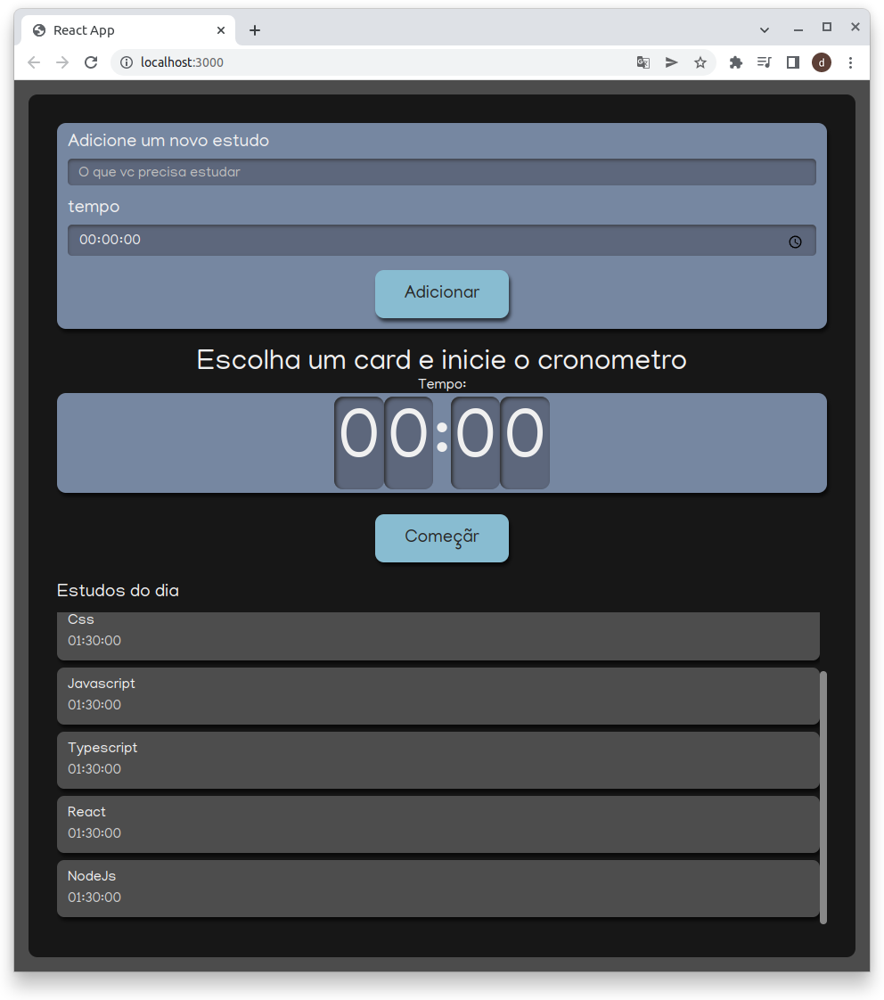

<h1 align="center">
  ReactJs and Typescript Timer
</h1>

  <a href="#-tecnologias">Tecnologias</a>&nbsp;&nbsp;&nbsp;|&nbsp;&nbsp;&nbsp;
  <a href="#-projeto">Projeto</a>&nbsp;&nbsp;&nbsp;|&nbsp;&nbsp;&nbsp;
  <a href="#memo-licença">Licença</a>

  
  
  

  

 

  
  

## 🚀 Tecnologias

Esse projeto foi desenvolvido com as seguintes tecnologias:

- HTML
- Sass
- JavaScript
- React
- Typescript
- Github

## 💻 Projeto

O Projeto Timer , é um projeto de estudo de ReactJs com Typescript, da Alura cursos: https://cursos.alura.com.br/course/react-modernizando-escrever-typescript

## :memo: Licença

Esse projeto está sob a licença MIT. Veja o arquivo [LICENSE](.github/LICENSE.md) para mais detalhes.
